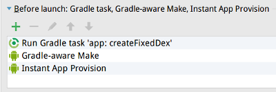

# 热修复演示
本demo演示了如何实现最简单的热修复

## 演示

  

- 启动后显示左图页面，点击”直接进“，在打开的页面中点击”调用方法“，会弹出toast "this is a bad method"，如中间图所示
- 启动后显示左图页面，点击”热修复一下再进“，在打开的页面中点击”调用方法“，会弹出toast "this is a good method"，如右图所示

## 如何运行
1. 通过Android Studio的package manager安装23.0.2版本的build-tools，和android 25 platform
2. 项目使用的gradle版本是3.5，android gradle plugin版本是2.2.0，如果没装的话可以提前下载
3. 打开项目，执行gradle sync以下载必要的依赖，完成后的工程结构:

4. 每次运行前，请执行以下gradle task:

或者直接把这个task设置到AS的run configuration里：

5. 运行：

## 实现目标
- 应用启动时，可以使用补丁dex对app代码进行热修复
- 实现了为了demo演示，而自动生成补丁dex的gradle代码

## 工程结构
- app模块即为demo所用模块

## 构建流程
1. :app:createFixedDex的gradle task会生成补丁dex，并放到app模块的assets目录下。这个task所依赖的task有两个:
2. :app:createFixedDexDir的gradle task会创建app模块下的assets目录，用来存储补丁dex
3. :app:createFixedClass的gradle task会在项目根目录下创建fixedClass目录，然后启动assemble，等assemble完成后从build目录中找到待修复的类的.class文件，使用java assist修复其错误的部分，生成修复后的.class文件存入fixedClass目录
4. 以上两个task完成后，:app:createFixedDex会从fixedClass目录中取出修复好的.class文件，使用buildTools中的dx工具生成补丁dex并放入app的assets目录下

## 运行流程
1. 启动后，application的onCreate方法里会从自己的assets目录下提取补丁dex，复制到应用的私有目录，并创建后面加载这个dex所用的类加载器的odex输出目录
2. WelcomeActivity在点击“直接进”后打开MainActivity，点击“调用方法”会调用Util类的showToast方法显示toast，因为此时未使用热修复，所以显示的是"this is a bad method"
3. WelcomeActivity在点击“热修复一下再进”后，会使用补丁dex针对Util类进行热修复，完成后会打开MainActivity，点击“调用方法”，因为Util类已被修复，会显示"this is a good method"，这个文案是硬编码在Util类中，证明修复确实起作用了，改变了这个类原有的硬编码文案

## 原理
1. 创建补丁dex的类加载器，通过反射提取其pathList中的elements
2. 通过反射提取应用的类加载器的pathList中的elements
3  创建新的elements数组，前者的elements复制进前面，后者的elements复制进后面
4. 将新的elements数组通过反射替换进应用类加载器的相同变量上，由于类加载器有不重复加载的规则，所以当加载到新elements数组中前面的，被修复的elements后，就不再加载后面的，有问题的elements
5. 因为上述原因，热修复必须发生在被修复类被加载之前才有效
